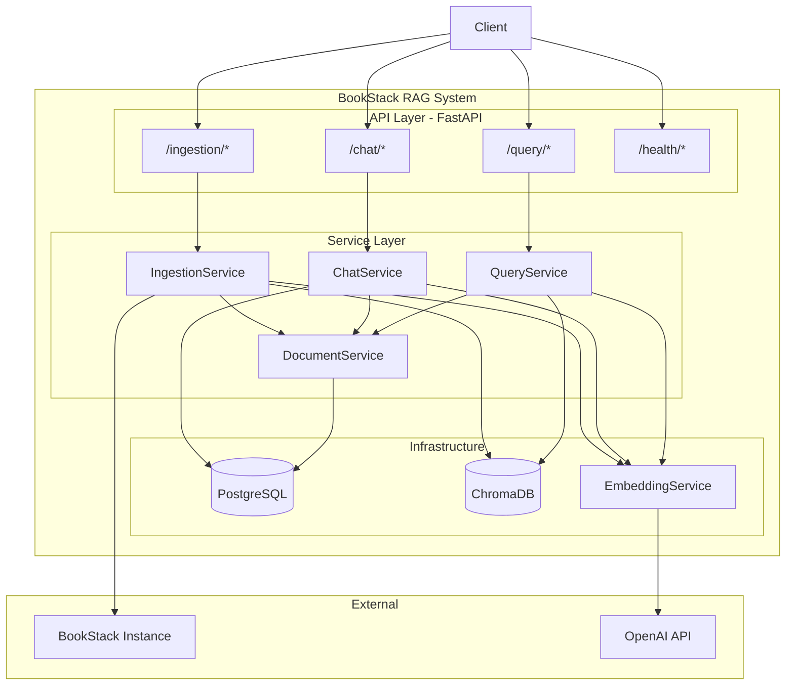
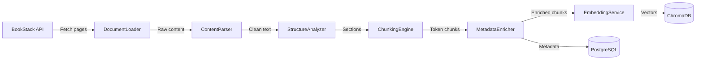
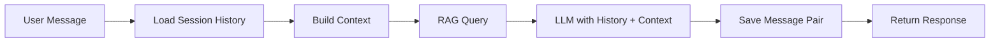
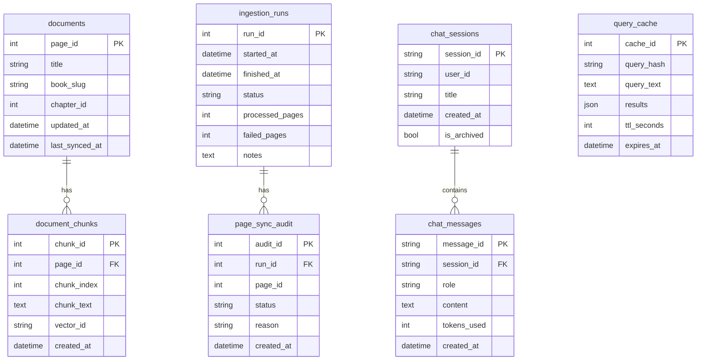

# Architecture

## System Overview

BookStack RAG is a retrieval-augmented generation system built with clean architecture principles. It ingests content from BookStack, creates vector embeddings, and serves semantic search and conversational AI through a FastAPI API.



## Architecture Layers

The codebase follows a clean architecture pattern with four layers. Dependencies point inward — outer layers depend on inner layers, never the reverse.

```
┌─────────────────────────────────────────────┐
│  API Layer          (app/api/)              │
│  Routes, schemas, dependency injection      │
├─────────────────────────────────────────────┤
│  Service Layer      (app/services/)         │
│  Business logic orchestration               │
├─────────────────────────────────────────────┤
│  Domain Layer       (app/domain/)           │
│  Entities, repository interfaces            │
├─────────────────────────────────────────────┤
│  Infrastructure     (app/infrastructure/)   │
│  Database, vector store, embeddings, APIs   │
└─────────────────────────────────────────────┘
```

### Domain Layer — `app/domain/`

Pure business logic with zero framework dependencies.

- **Entities** (`entities/`) — Dataclass models representing core concepts: `Document`, `DocumentChunk`, `ChatMessage`, `ChatSession`
- **Repository interfaces** (`repositories/`) — Abstract base classes defining data access contracts: `IDocumentRepository`, `IChatSessionRepository`, `IChatMessageRepository`
- **Exceptions** (`exceptions.py`) — Domain-specific errors: `DocumentNotFound`, `ChatSessionNotFound`

### Infrastructure Layer — `app/infrastructure/`

Concrete implementations of domain abstractions.

| Module | Purpose |
|--------|---------|
| `database/models.py` | SQLAlchemy ORM models (`DocumentORM`, `ChatSessionORM`, etc.) |
| `database/repositories/` | Repository implementations using SQLAlchemy sessions |
| `database/session.py` | Database session management and connection pooling |
| `vector_store/` | `IVectorStore` interface and ChromaDB implementation |
| `embeddings/` | `IEmbeddingService` interface (OpenAI and local implementations) |
| `external/` | `IBookStackClient`, `ILLMClient`, `IRerankerClient` interfaces |

### Service Layer — `app/services/`

Business logic orchestration. Services coordinate between repositories and external services. No direct database queries or framework imports.

| Service | Responsibility |
|---------|---------------|
| `QueryService` | RAG query pipeline — embed query, search vectors, optional reranking and LLM generation |
| `ChatService` | Multi-turn conversations — session management, context building, response generation |
| `IngestionService` | Document sync — fetch from BookStack, chunk, embed, store |
| `DocumentService` | Document CRUD via repository pattern |

### API Layer — `app/api/`

FastAPI endpoints, Pydantic schemas, and dependency injection.

- **Routes** (`routes/`) — Endpoint handlers for query, chat, ingestion, and health
- **Schemas** (`schemas/`) — Pydantic request/response models with validation
- **Dependencies** (`dependencies.py`) — Service factory functions injected via `Depends()`

## Data Flow

### Ingestion Pipeline



1. **Fetch** — `BookStackClient` retrieves pages via the BookStack API with rate limiting
2. **Parse** — `ContentParser` converts Markdown/HTML to clean text
3. **Analyze** — `StructureAnalyzer` extracts heading hierarchy and section paths
4. **Chunk** — `ChunkingEngine` splits text into token-sized chunks (configurable size/overlap)
5. **Enrich** — `MetadataEnricher` adds section paths, token counts, and document metadata
6. **Embed** — `EmbeddingService` generates vectors (OpenAI or local sentence-transformers)
7. **Store** — Vectors go to ChromaDB, metadata and chunks go to PostgreSQL
8. **Audit** — Each page sync is recorded with status and reason for traceability

### Query Flow


### Chat Flow



## Database Schema



## Technology Stack

| Component | Technology | Purpose |
|-----------|-----------|---------|
| API Framework | FastAPI | HTTP endpoints, WebSocket, OpenAPI docs |
| ORM | SQLAlchemy 2.0 | Database models and queries |
| Migrations | Alembic | Schema versioning |
| Settings | Pydantic Settings | Type-safe configuration from env vars |
| Vector DB | ChromaDB | Embedding storage and similarity search |
| Embeddings | OpenAI / sentence-transformers | Text-to-vector conversion |
| LLM | OpenAI GPT | Answer generation |
| Logging | structlog | Structured JSON logging |
| Tokenizer | tiktoken | Token-aware chunking |

## Dependency Injection

Services are constructed in `app/api/dependencies.py` and injected into routes via FastAPI's `Depends()`:

```python
@router.post("/")
async def query(
    request: QueryRequest,
    service: QueryService = Depends(get_query_service),
):
    result = service.query(request.query, top_k=request.top_k)
    return QueryResponse(**result.to_dict())
```

This keeps routes thin (HTTP handling only), services testable (mock dependencies), and infrastructure swappable (implement the interface).
