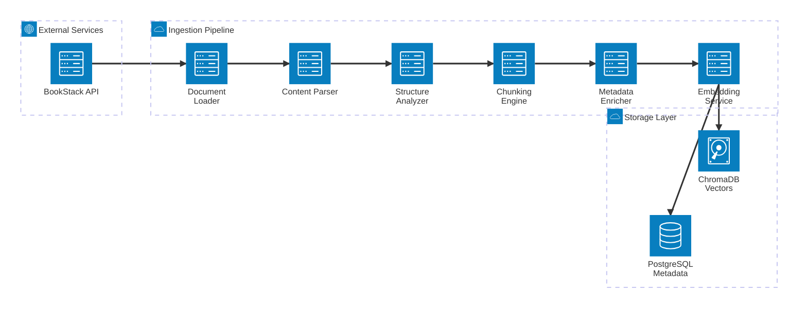
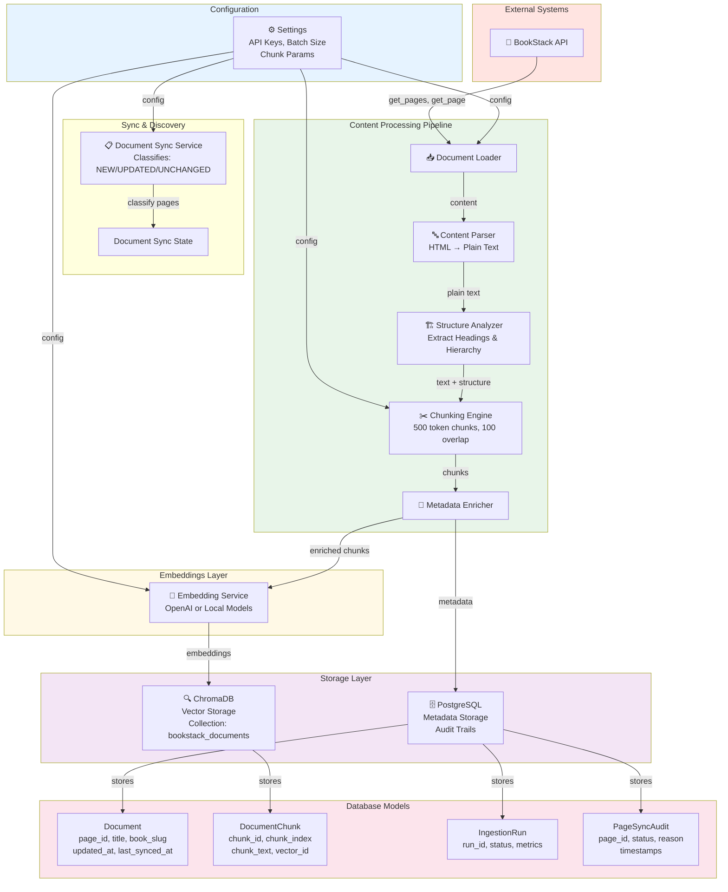
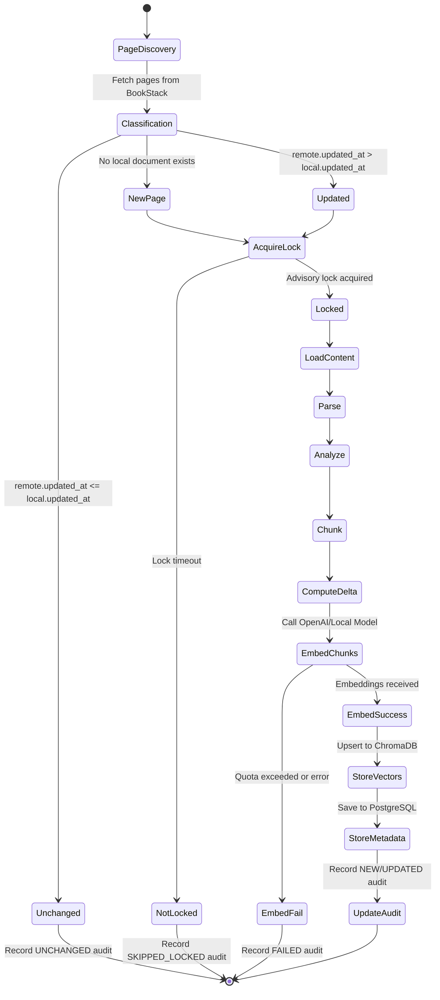
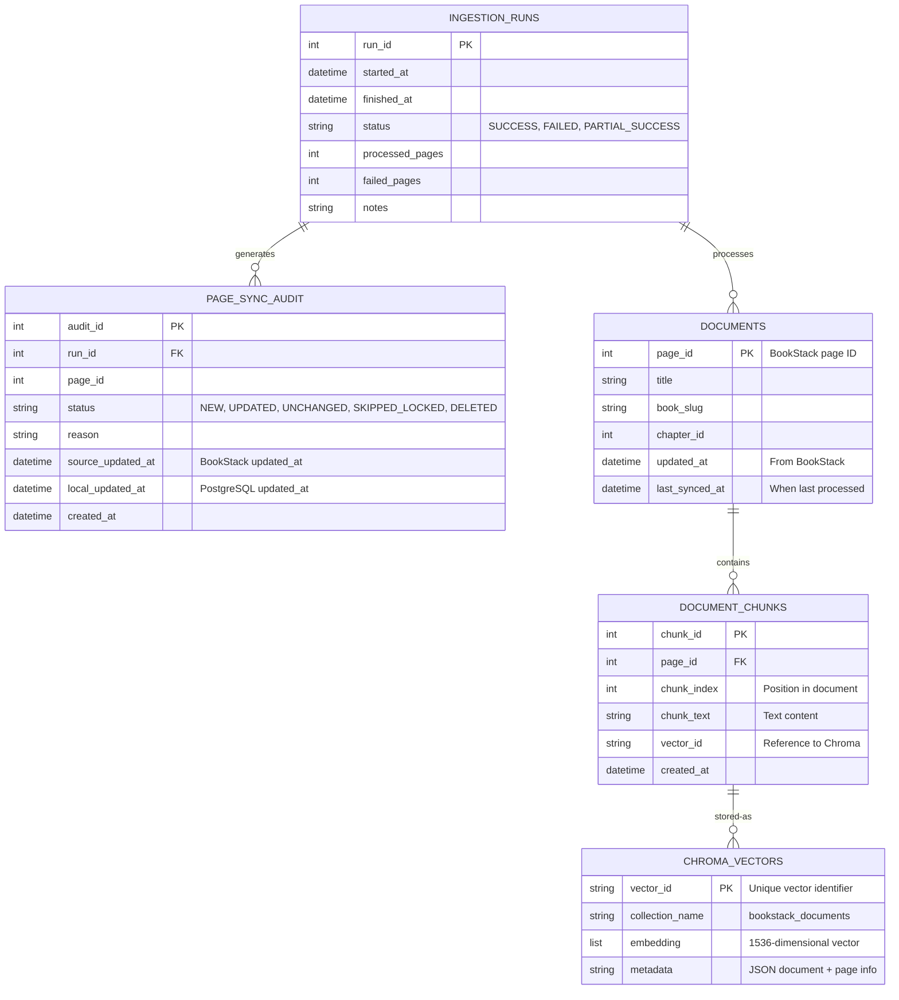
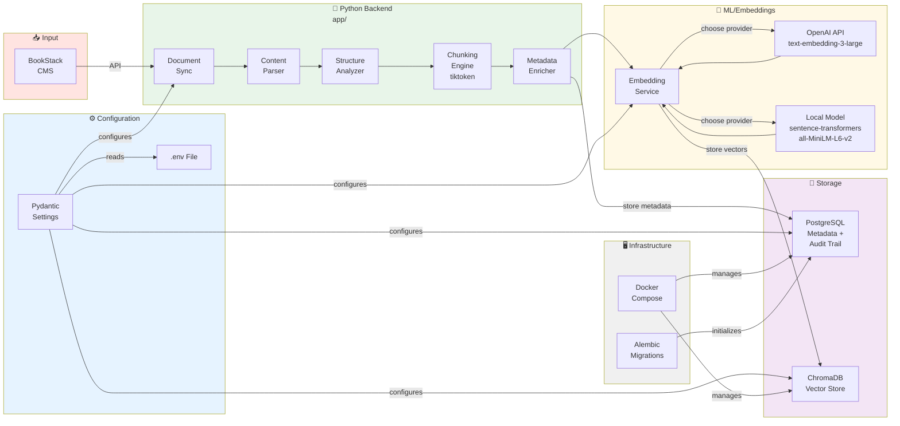
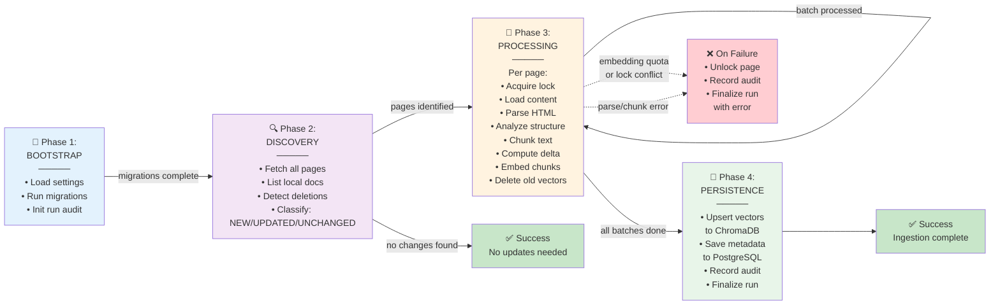

# BookStack RAG Ingestion - System Analysis

## Overview

**BookStack RAG Ingestion** is a production-grade Python pipeline that synchronizes content from a BookStack CMS instance, processes it through multiple transformation stages, generates embeddings, and persists both vector embeddings and metadata to specialized databases.

**Key Purpose**: Transform raw content into queryable RAG (Retrieval-Augmented Generation) indexed documents.

**Technology Stack**:
- **Backend**: Python 3.11+, SQLAlchemy ORM
- **Embeddings**: OpenAI API (`text-embedding-3-large`) or local `sentence-transformers`
- **Tokenization**: `tiktoken` (cl100k encoding)
- **Vector Store**: ChromaDB (1536-dimensional embeddings)
- **Metadata Store**: PostgreSQL + Alembic migrations
- **Infrastructure**: Docker Compose, async rate-limiting

---

## 1. System Architecture (High-Level)



### Architecture Overview

- **Source**: BookStack API (configured via token authentication)
- **Processing Pipeline**: 6-stage linear transformation
- **Output**: Dual-store persistence (vectors + metadata)
- **Fault Tolerance**: Retry logic, rate limiting, advisory locks

---

## 2. Component Interaction & Dependencies



### Component Details

| Component | Purpose | Key Features |
|-----------|---------|--------------|
| **Document Loader** | Fetches full page content from BookStack API | Handles rate limits, retries, OAuth token management |
| **Content Parser** | Converts HTML to plain text | Markdown preservation, heading extraction |
| **Structure Analyzer** | Parses document hierarchy | Extracts h1–h6 levels, creates nav tree |
| **Chunking Engine** | Tokenizes text with overlap | 500-token chunks, 100-token overlap, `tiktoken` |
| **Metadata Enricher** | Adds context to chunks | Page metadata, hierarchy depth, proximity info |
| **Embedding Service** | Generates vector representations | OpenAI (3-large) or local (sentence-transformers) |
| **Metadata Store** | Relational data persistence | SQLAlchemy ORM, PostgreSQL, audit trail |
| **Vector Store** | Vector search index | ChromaDB with collection `bookstack_documents` |

---

## 3. Runtime Ingestion Flow

```mermaid
flowchart TD
    Start([Start Ingestion]) --> Settings[Load Settings]
    Settings --> Migration[Run Migrations]
    Migration --> InitRun[Initialize Run Audit]
    
    InitRun --> FetchPages[Fetch All Pages from BookStack]
    FetchPages --> ListLocal[List Local Documents]
    
    ListLocal --> DetectDel{Detect Deletions}
    DetectDel -->|found deleted pages| PurgePages[Purge Deleted Pages<br/>from Vector & DB]
    PurgePages --> ClassifyPages
    DetectDel -->|no deletions| ClassifyPages[Classify Pages<br/>NEW/UPDATED/UNCHANGED]
    
    ClassifyPages --> HasChanges{Pages to<br/>Sync?}
    HasChanges -->|no changes| FinishRun[Finish Run<br/>Status: SUCCESS]
    
    HasChanges -->|yes| CreateBatches[Create Sync Batches]
    CreateBatches --> ProcessBatch["For Each Batch:"]
    
    ProcessBatch --> AcquireLock["Acquire Page Lock"]
    AcquireLock --> LockStatus{Lock<br/>Acquired?}
    
    LockStatus -->|no| AuditSkipped["Record SKIPPED_LOCKED"]
    LockStatus -->|yes| LoadPage[Load Page Content]
    
    LoadPage --> Parse[Parse Content HTML→Text]
    Parse --> Analyze[Analyze Structure<br/>Extract Headings]
    Analyze --> Chunk[Create Text Chunks<br/>with Overlap]
    
    Chunk --> ComputeDelta[Compute Chunk Delta<br/>vs Previous]
    ComputeDelta --> DeleteChunks[Delete Removed Chunks<br/>from Vector & DB]
    
    DeleteChunks --> EmbedNew[Embed New/Changed Chunks<br/>using OpenAI or Local Model]
    EmbedNew --> UpsertVector[Upsert to ChromaDB]
    UpsertVector --> SaveMetadata[Save Metadata to PostgreSQL]
    
    SaveMetadata --> AuditSuccess["Record Page Audit<br/>Status: NEW/UPDATED"]
    AuditSuccess --> MoreBatches{More<br/>Batches?}
    
    MoreBatches -->|yes| ProcessBatch
    MoreBatches -->|no| FinishRun
    
    AuditSkipped --> MoreBatches
    FinishRun --> End([End Ingestion])
    
    style Start fill:#90EE90
    style End fill:#FFB6C6
    style FinishRun fill:#87CEEB
    style EmbedNew fill:#FFD700
    style UpsertVector fill:#DDA0DD
    style SaveMetadata fill:#DDA0DD
```



### Ingestion Phases

#### Phase 1: Bootstrap
- Load environment configuration (Pydantic `Settings`)
- Run Alembic migrations to initialize schema
- Create ingestion run audit row to track this execution

#### Phase 2: Discovery
- Fetch all pages from BookStack API
- Compare to local documents to find deletions
- Classify candidate pages as `NEW`, `UPDATED`, or `UNCHANGED`
  - **NEW**: No local document record
  - **UPDATED**: `remote.updated_at > local.updated_at`
  - **UNCHANGED**: No time-based change detected

#### Phase 3: Per-Page Processing (within batches)
1. **Acquire Advisory Lock**: Prevents concurrent processing of same page
2. **Load**: Fetch full page from API
3. **Parse**: Convert HTML/Markdown to plain text
4. **Analyze**: Extract document structure (headings, nesting)
5. **Chunk**: Tokenize text into 500-token overlapping segments
6. **Delta**: Compare chunks with previous version
7. **Delete**: Remove vectors for deleted/stale chunks
8. **Embed**: Generate vectors (OpenAI or local model)
9. **Upsert**: Store vectors in ChromaDB

#### Phase 4: Persistence
- Commit metadata to PostgreSQL
- Record page-level audit entry
- Finalize ingestion run (status, metrics)

---

## 4. Page Processing State Machine



### Page Status Codes

| Status | Meaning | Action |
|--------|---------|--------|
| `NEW` | First ingestion of page | Full processing pipeline |
| `UPDATED` | Page modified since last sync | Reprocess, compute chunk delta |
| `UNCHANGED` | No update detected | Log audit, skip processing |
| `SKIPPED_LOCKED` | Lock acquisition failed | Retry in next run |
| `DELETED` | Page removed from BookStack | Purge vectors and metadata |
| `FAILED` | Error during processing | Unlock, log error, continue batch |

---

## 5. Database Schema & Relationships



### Table Details

**INGESTION_RUNS**
- Tracks each execution of the pipeline
- Captures start/finish times, overall status, success/failure counts
- Used for audit trail and debugging

**PAGE_SYNC_AUDIT**
- Per-page execution log for each run
- Records classification decision, timestamps, error reasons
- Enables delta detection across runs

**DOCUMENTS**
- Master record for each BookStack page
- Stores metadata (title, book slug, chapter)
- `last_synced_at` used for next-run comparison

**DOCUMENT_CHUNKS**
- One row per processed text chunk
- Links to parent document and vector ID in ChromaDB
- Enables reverse lookup from vector → metadata

**CHROMA_VECTORS (external)**
- Managed by ChromaDB
- 1536-dimensional embeddings (OpenAI model)
- Metadata includes document context for retrieval

---

## 6. Technology Stack & Infrastructure



### Technology Details

| Layer | Technology | Purpose | Configuration |
|-------|-----------|---------|----------------|
| **Backend** | Python 3.11+ | Ingestion pipeline | Pydantic `Settings` |
| **Web Client** | `requests` + retry adapter | HTTP to BookStack API | Token auth, rate limiting |
| **Parsing** | Markdown, HTML parsing | HTML → plain text conversion | Built-in parsers |
| **Tokenization** | `tiktoken` (cl100k_base) | Token-accurate chunking | 500-token chunks, 100-overlap |
| **Embeddings (Primary)** | OpenAI API (`text-embedding-3-large`) | High-quality vectors | `OPENAI_API_KEY` required |
| **Embeddings (Fallback)** | `sentence-transformers` (`all-MiniLM-L6-v2`) | Local, free alternative | CPU/GPU inference |
| **Vector DB** | ChromaDB | Similarity search index | Persistent disk storage |
| **Metadata DB** | PostgreSQL + psycopg2 | Relational audit trail | SQLAlchemy ORM |
| **Migrations** | Alembic | Schema versioning | Automatic on startup |
| **Orchestration** | Docker Compose | Multi-container setup | PostgreSQL, ChromaDB services |

---

## 7. Four Execution Phases (Summary)



---

## 8. Configuration & Environment

<[app/config/settings.py](app/config/settings.py)> defines all system configuration via Pydantic `BaseModel`:

### Essential Environment Variables

```bash
# BookStack API
BOOKSTACK_URL=http://bookstack.local
BOOKSTACK_TOKEN_ID=your_token_id
BOOKSTACK_TOKEN_SECRET=your_token_secret

# PostgreSQL
POSTGRES_HOST=localhost
POSTGRES_PORT=5432
POSTGRES_DB=bookstack_rag
POSTGRES_USER=postgres
POSTGRES_PASSWORD=postgres

# Embeddings
OPENAI_API_KEY=sk-...
EMBEDDING_PROVIDER=openai  # or "local"
EMBEDDING_FAIL_FAST_ON_QUOTA=true

# Processing Parameters
CHUNK_SIZE=500
CHUNK_OVERLAP=100
SYNC_BATCH_SIZE=50
BOOKSTACK_REQUESTS_PER_SECOND=5.0

# ChromaDB
CHROMA_PATH=./chroma_data
CHROMA_COLLECTION_NAME=bookstack_documents
CHROMA_USE_HTTP=false
```

---

## 9. Key Features & Capabilities

### ✅ Implemented Features

1. **BookStack Sync**: Token-based auth, pagination, rate limiting
2. **Intelligent Delta Detection**: Compares `updated_at` timestamps
3. **Deletion Tracking**: Identifies and purges removed pages
4. **Concurrent Safety**: Advisory locks prevent race conditions
5. **Resilient Retries**: Exponential backoff for API and embedding failures
6. **Dual Storage**: Vectors (ChromaDB) + metadata (PostgreSQL)
7. **Flexible Embeddings**: OpenAI or local models (fallback)
8. **Token-Accurate Chunking**: `tiktoken` with configurable overlap
9. **Structure Preservation**: Heading hierarchy and nesting captured
10. **Audit Trail**: Per-run and per-page success/failure tracking
11. **Batch Processing**: Configurable batch size with progress reporting

### ❌ Out of Scope

- **Query Layer**: No LLM integration or retrieval API (intentional design)
- **Frontend UI**: Pure Python/CLI ingestion pipeline
- **Learning/Fine-tuning**: One-way ingestion only
- **Multi-tenant**: Single BookStack instance per deployment

---

## 10. Data Flow Example: Single Page

```
BookStack Page (HTML)
  ↓
Document Loader [get_page()]
  ↓
Content Parser → "Some heading\n\nParagraph text..."
  ↓
Structure Analyzer → [[heading: "Some heading", level: 1], [text_node: "Paragraph..."]]
  ↓
Chunking Engine → [TextChunk(index=0, text="Some heading...", tokens=412), ...]
  ↓
Metadata Enricher → [EnrichedChunk(text=..., source_page=..., depth=1), ...]
  ↓
Embedding Service → [[0.123, -0.456, ...], [0.789, 0.012, ...]]  (1536-dim vectors)
  ↓
Split Path:
  ├→ ChromaDB: INSERT/UPDATE vectors with collection metadata
  └→ PostgreSQL: INSERT documents, chunks, audit entries
  ↓
Collection available for retrieval queries
```

---

## 11. Error Handling & Recovery

| Error Scenario | Handling Strategy |
|--|--|
| BookStack API timeout | Retry with exponential backoff (4 attempts) |
| OpenAI quota exceeded | Fail-fast or fall back to local embedding model |
| Database constraint violation | Roll back transaction, log, continue batch |
| Lock acquisition timeout | Record `SKIPPED_LOCKED`, retry next run |
| Parse/chunk errors | Unlock page, record `FAILED`, continue batch |
| Embedding API 5xx error | Exponential backoff, up to max retries |

---

## 12. Performance Characteristics

| Metric | Typical Value | Configurable |
|--------|---------------|--------------|
| Chunk size | 500 tokens | `CHUNK_SIZE` |
| Chunk overlap | 100 tokens | `CHUNK_OVERLAP` |
| Sync batch size | 50 pages | `SYNC_BATCH_SIZE` |
| BookStack request rate | 5 reqs/sec | `BOOKSTACK_REQUESTS_PER_SECOND` |
| Embedding batch size | All chunks in page | Service-dependent |
| Vector dimension | 1536 | OpenAI model-dependent |
| Max retries | 4 | `*_MAX_RETRIES` settings |
| Backoff factor | 1.0 sec | `RETRY_BACKOFF_SECONDS` |

**Throughput**: Depends on embedding service (OpenAI ~60–100 API calls/min, local instant)

---

## 13. Project Structure

```
bookstack-rag-ingestion/
├── app/
│   ├── analyzers/          # Document structure analysis
│   ├── chunking/           # Text tokenization & chunking
│   ├── clients/            # BookStack API client
│   ├── config/             # Pydantic settings & environment
│   ├── db/                 # SQLAlchemy ORM, migrations, stores
│   ├── embeddings/         # OpenAI/local embedding service
│   ├── loaders/            # Document fetcher
│   ├── metadata/           # Chunk enrichment
│   ├── parsers/            # HTML/Markdown parsing
│   ├── pipelines/          # Main orchestrator
│   └── sync/               # Page classification & sync logic
├── db/
│   └── alembic/            # Schema migrations
├── scripts/
│   ├── db_migrate.py       # Migration CLI
│   └── run_ingestion.py    # Main entry point
├── docs/
│   ├── LOW_LEVEL_ARCHITECTURE_DIAGRAMS.md
│   └── LOW_LEVEL_IMPLEMENTATION.md
├── docker-compose.yml      # PostgreSQL + ChromaDB services
├── requirements.txt        # Python dependencies
└── alembic.ini             # Migration configuration
```

---

## 14. Entry Points

### Primary Ingestion
```bash
python scripts/run_ingestion.py
```
- Loads environment from `.env`
- Runs `IngestionPipeline.run()`
- Executes all four phases
- Returns exit code (0 = success, 1 = failure)

### Database Migration
```bash
python scripts/db_migrate.py
```
- Applies Alembic migrations manually
- Used during bootstrap or maintenance

---

## Summary

The **BookStack RAG Ingestion** system is a well-architected, production-ready pipeline that:

✅ Automatically syncs content from BookStack  
✅ Performs sophisticated text processing (parsing, analysis, chunking)  
✅ Generates high-quality embeddings (OpenAI or local)  
✅ Maintains dual persistence (vector + relational)  
✅ Provides comprehensive audit trails  
✅ Handles concurrency safely  
✅ Recovers from transient failures gracefully  

The system enables RAG applications by providing a robust foundational layer for content ingestion while leaving the query/LLM integration to downstream systems.

