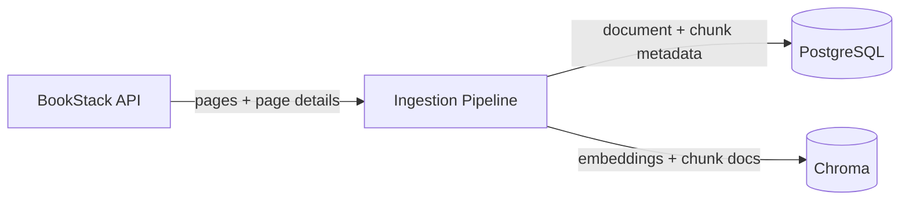
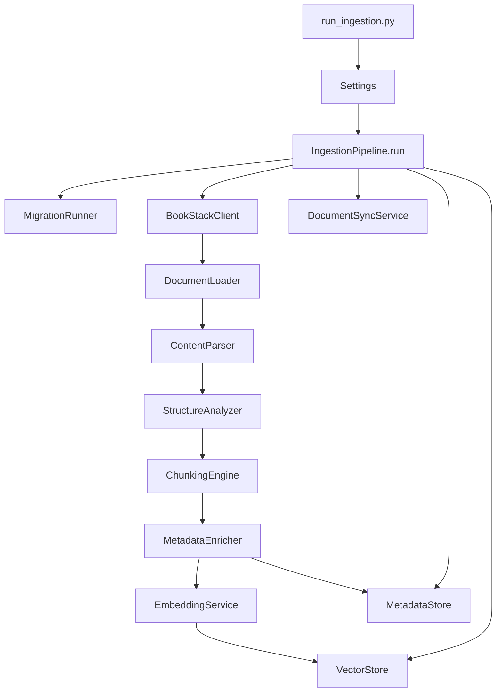
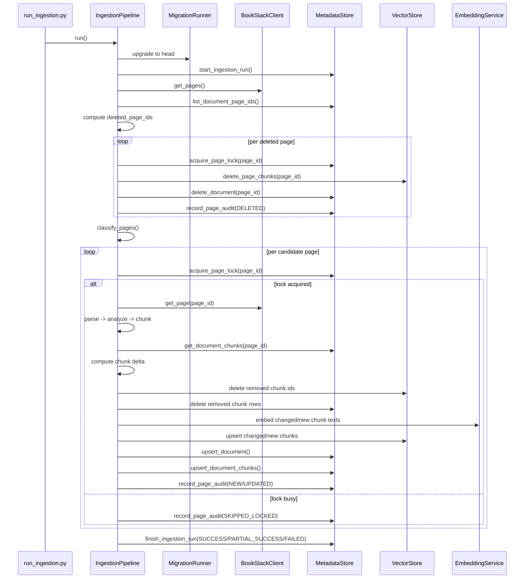
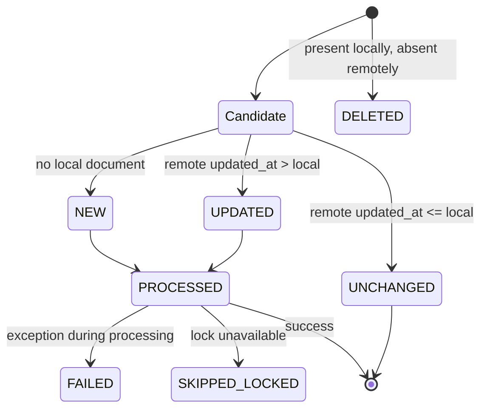
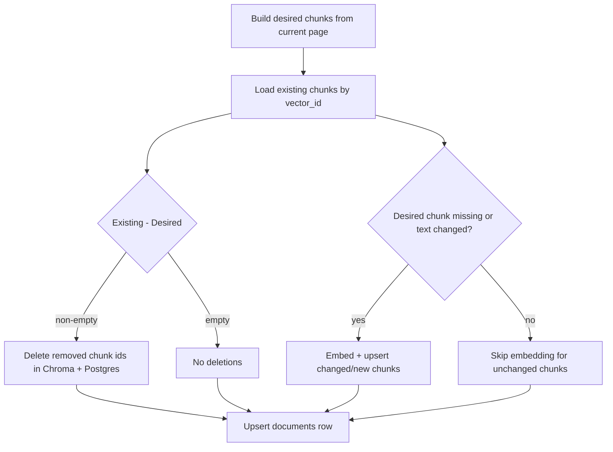
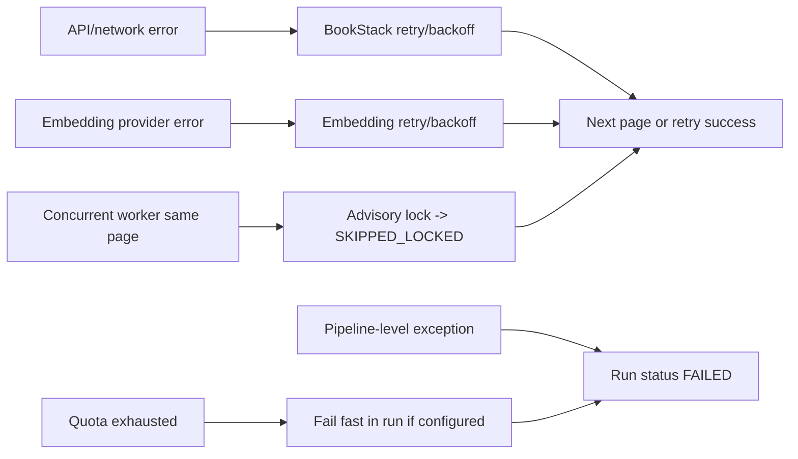

# Low-Level Architecture Diagrams

This document provides analysis-focused architecture diagrams for the BookStack ingestion pipeline.

## 1) System Context



## 2) Runtime Component Flow



## 3) Ingestion Sequence (Per Run)



## 4) Relational Data Model

```mermaid
erDiagram
    DOCUMENTS ||--o{ DOCUMENT_CHUNKS : has
    INGESTION_RUNS ||--o{ PAGE_SYNC_AUDIT : records

    DOCUMENTS {
      bigint page_id PK
      text title
      text book_slug
      bigint chapter_id
      timestamptz updated_at
      timestamptz last_synced_at
    }

    DOCUMENT_CHUNKS {
      bigint chunk_id PK
      bigint page_id FK
      int chunk_index
      text chunk_text
      text vector_id UNIQUE
      timestamptz created_at
    }

    INGESTION_RUNS {
      bigint run_id PK
      timestamptz started_at
      timestamptz finished_at
      text status
      int processed_pages
      int failed_pages
      text notes
    }

    PAGE_SYNC_AUDIT {
      bigint audit_id PK
      bigint run_id FK
      bigint page_id
      text status
      text reason
      timestamptz source_updated_at
      timestamptz local_updated_at
      timestamptz created_at
    }
```

## 5) Page Decision State Model



## 6) Chunk Delta Decision Logic



## 7) Failure and Recovery Paths



## 8) How To Use These Diagrams

- Start with System Context to orient storage boundaries.
- Use the Ingestion Sequence diagram to debug a single run.
- Use the Chunk Delta diagram when vector counts do not match expected text changes.
- Use the State Model with `page_sync_audit` to explain why a page was or was not reprocessed.
